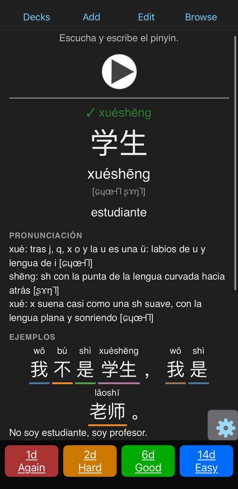
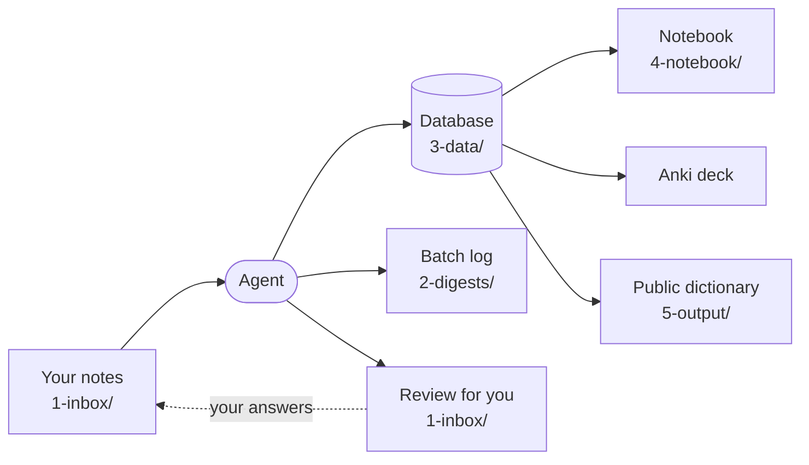

<p align="center">
  <a href="https://infraphysics.net/corner/chinese"></a>
</p>

<h1 align="center">apkg-chinese-structs</h1>

<p align="center">
  Raw Mandarin class notes in, a structured Anki deck out.<br>
  Pinyin, tones, IPA, audio, and a review after every batch telling you what you're missing.
</p>

<p align="center">
  <a href="https://github.com/yago-mendoza/apkg-chinese-structs/actions/workflows/check.yml"></a>
  <a href="LICENSE"></a>
  <a href="LICENSE-CONTENT"></a>
</p>

<p align="center">
  <b>A side project of <a href="https://infraphysics.net">InfraPhysics</a>.</b>
  Browse the whole dictionary, with audio, at <a href="https://infraphysics.net/corner/chinese"><b>infraphysics.net/corner/chinese</b></a>
</p>

---

## TL;DR

- **You** drop class notes in `1-inbox/`, in any format, and now and then say *process the inbox*.
- **The agent** turns them into dictionary entries, sentences and cards, generates the audio and loads the deck into Anki.
- **After each batch** it leaves you a review: your level, gaps, what didn't go in and why. You answer inline; your answers feed the next batch.
- **You study** in Anki (soon, one HSK level at a time). Nothing else to maintain.

<p align="center">
  
</p>

I built this for my own Mandarin, so the repository ships with a real, working example: my deck, **🐉 Chino práctico**, built from my classes. The deck and my working notes are in Spanish; the system works for any learner. Use it as is, or empty it and start with your own notes.

## How it works



**`1-inbox/`: where you write.** Notes exactly as they come out: phone notes, transcribed photos, half-finished lists, questions. The only thing that helps is the date you wrote each thing down. The agent's review lands here too, with a line under each point for your answer.

**`1-inbox/history/`: the inbox's archive.** When a batch is closed, your notes and the review you answered are filed here untouched, one folder per batch.

**`2-digests/`: one log per batch.** The agent's record: what went in, what did not and why, what it corrected and what it reorganized, plus a running reflection on your level, your classes and your method. Read-only; it is the system's memory.

**`3-data/`: the database.** Everything the deck knows, one file per theme: words, expressions, characters, pronunciation rules, groups of easily confused items, sentences, cards and the generated audio. Only the agent edits it.

**`4-notebook/`: the same database, readable.** Everything learned so far, by theme. Open it to look something up without Anki.

**`5-output/`: what comes out.** The compiled deck (`.apkg`, downloadable) and the public export (`dictionary.json`: entries, sentences, every card as Anki renders it, and the day-by-day history of the deck) behind [infraphysics.net/corner/chinese](https://infraphysics.net/corner/chinese).

**Batches.** A batch is whatever is in the inbox when you ask; how often is up to you. One a week is a good habit, since the review then arrives in time for your next class, but nothing depends on it: small batches give you feedback sooner, large ones let the agent see more at once. The structure is never frozen: every batch, themes and groups are revisited and reorganized when needed, without losing your progress.

**Nothing drifts out of sync.** `3-data/` is the single source of truth; the notebook, the deck and the dictionary are generated from it. `anki.py check` validates every change before it reaches Anki, and every closed batch is committed and tagged, so any earlier state can be recovered.

## What you don't need to worry about

- **Duplicate or redundant cards.** `check` flags cards that test the same thing; the agent merges them.
- **Words you can say but never use.** Every word you want to be able to say must appear in at least one sentence; if none does, the review asks you for one.
- **Mistakes in your notes.** The agent fixes misread glosses and readings, marks them ⚠️ in the log and asks about anything doubtful in the review.
- **Choosing themes up front.** Themes are reorganized whenever needed. Every card has a permanent ID, so moving or correcting it keeps its review history in Anki.
- **How many cards, and of what kind.** `anki.py` derives them from what you need each word for: reading it, understanding it by ear, or saying it.
- **Audio.** Only missing audio is synthesized, and it is cached; nothing is paid for twice.
- **Editing cards in Anki.** Don't: every push overwrites the deck from `3-data/`. Tell the agent instead and it fixes the source.

## What makes it more than generated flashcards

Generating cards is the easy part. What makes the system useful is that the agent hands work back to the learner and closes the loop:

- **A review after every batch**, with a line to answer under each point. The agent asks for real sentences instead of inventing them, points out thematic gaps (you can say *morning* and *evening*, but not *afternoon*) and suggests what to learn next at your level.
- **Filtering, not hoarding.** Nothing is silently dropped: 🟡 recognize only, ❌ literary, archaic or obsolete, each with its reason.
- **Recall, not rereading.** Cards ask you to produce: type the pinyin or the hanzi, mark tones with digits, say sentences aloud and compare with the audio.
- **Contrast and context.** Items that get confused (他/她/它, 生/牛/午) or form a series (上午/中午/下午/晚上) are shown together on the back of the card.
- **Explicit pronunciation.** IPA, pinyin traps for Spanish speakers, and tone-sandhi rules wherever a card asks you to speak or listen.
- **Rules that do not depend on the model.** Which cards are required, which are redundant and what is still missing is computed by `anki.py` from a written specification. The model writes; the code checks. A better model improves the deck without changing the system.

## The learner's goal: a swappable module

Everything that depends on *who* is learning lives in one file, [`docs/goal.md`](docs/goal.md): who they are, why they study, what should go in (to say, to understand, or not at all), in what order, and which gaps to point out. The agent reads it before every batch and applies it as the first filter on every decision.

It works as a swappable prompt module. [`docs/design.md`](docs/design.md) describes *how* the system works (formats, cards, coverage, audio, Anki) and holds no personal preferences; `goal.md` says *what* and *why* for this particular learner. Change the goal (more business vocabulary, less reading, a different person) and the agent's decisions change with it, without touching the code or the specification.

## Levels (HSK 3.0)

The deck is ordered by difficulty using the levels of the HSK 3.0 (the 2021 standard): 1 to 6, plus 7 for the advanced band (levels 7 to 9 share one vocabulary list). The HSK is the scale, not the goal: the aim is to speak, and items that are not on the official list get a level too.

- **Every item has a level.** Words on the official list (`sources/hsk/`) take their official level, computed by `anki.py`. Anything else gets a level estimated by the agent, with the reason written down. A sentence takes the highest level of its words, so it never smuggles in vocabulary from a later level.
- **Level first, theme second.** In Anki: `🐉 Chino práctico::HSK 1::02 Saludos y cortesía`. Moving an item to another level keeps its review history.
- **One level at a time.** You study the subdeck of your current level. Anything from a higher level, even if it came from your own notes, is filed under its level and waits.
- **Knowing where you stand.** Every review reports how much of each level's vocabulary the deck covers. When you reach a level (at least 80% of its vocabulary, plus the agent's judgement on the sentence patterns you already handle), the agent says so clearly. Anything that arrives later from a level you already passed is flagged as a gap from that level.
- **Gaps against a curriculum.** The review compares the deck with your current level, both the official list and the lesson-by-lesson sequence of standard courses, and suggests what is missing.

Status: decided and documented; being implemented. Today the deck is still split by theme only.

## Getting started

Setup, once (Windows shown; any OS with Python 3 works):

```powershell
python -m venv .venv
.\.venv\Scripts\python -m pip install -r requirements.txt
```

- **Audio**: an Azure AI Speech resource on the paid S0 tier (a few cents per batch), with `AZURE_SPEECH_KEY` and `AZURE_SPEECH_REGION` set as environment variables (see `.env.example`). The free F0 tier is fine for personal use, but its audio may not be redistributed.
- **Anki**: Anki desktop with the AnkiConnect add-on (`2055492159`), signed in to AnkiWeb to sync with your phone.

Then, for each batch:

1. Put your notes in `1-inbox/`, with the date you wrote them.
2. Open a coding agent in the repository and ask it to *process the inbox*.
3. Answer the review it leaves in `1-inbox/` whenever you like; your answers go into the next batch.

The agent pushes the deck itself. To do it by hand:

```powershell
.\.venv\Scripts\python anki.py audio   # synthesize only the missing audio
.\.venv\Scripts\python anki.py push    # build, open Anki, import, set limits and order, sync
```

## Studying

- Study the subdeck of your current level (until levels land, the parent deck). Themes are subdecks inside it, and level, theme, month and purpose are also tags for filtered sessions.
- Typed answers accept pinyin with tone marks or digits (`ni3 hao3`) or hanzi from a Chinese keyboard; spaces, case and punctuation are ignored. For sentences you say aloud, typing is optional.
- The back of each card shows pinyin, IPA, audio, pronunciation traps and, when there is one, the word's family, with the tested word marked ▸.
- `push` sets the daily limits (`NEW_PER_DAY`, `REVIEWS_PER_DAY` in `anki.py`). Reviews settle at roughly 5 to 8 times the new cards: 20 new cards a day means about 100 to 160 reviews, around 25 to 30 minutes.

## Using it with your own notes

1. Fork or clone the repository.
2. Empty the content but keep the structure: clear `1-inbox/history/`, `2-digests/`, `3-data/audio/` and the review in `1-inbox/` (keep each `README.md`); delete the files in `3-data/lexicon/`, `3-data/sentences/` and `3-data/exercises/`; adjust `3-data/themes.yaml`. `4-notebook/` regenerates itself.
3. In `anki.py`, change `DECK_NAME` and `GUID_NAMESPACE` so your deck never collides with this one.
4. Rewrite `docs/goal.md` for yourself (who is learning, why, what should go in, in what order) and replace `docs/owner.md` with your own notes. The pronunciation traps assume a Spanish speaker.
5. Set up Azure and Anki as above, drop your first notes in `1-inbox/` and ask your agent to *process the inbox*. `AGENTS.md` tells it everything else.

## Reference

**Documents**

- `AGENTS.md`: rules for any agent; the first thing it reads.
- `docs/goal.md`: the learner's goal: the first filter for everything that goes in.
- `docs/design.md`: the full specification (coverage, card types, audio, decisions).
- `docs/owner.md`: my own setup and decisions for this deck.
- `sources/`: external reference lists, each with its origin and license.

**Commands** (mostly for the agent): `lookup <term>`, `plan` (missing cards), `scaffold` (writes them in the standard format), `gaps` (how the deck is distributed), `check`, `notebook`, `build`, `export` (the public dictionary), `close-batch <batch>` (archive, commit and tag), `audio`, `push`. `push --prune` removes cards whose exercise no longer exists (it lists them first and requires `--force` if there are many); `push --reset` returns the whole deck to new, with no progress. Tests: `.\.venv\Scripts\python -m unittest discover -s tests`, including a simulated AnkiConnect that checks nothing outside this deck is ever moved, deleted or reconfigured. GitHub Actions runs `check` and the tests on every push.

**External lists.** Your notes and your goal decide what goes in. The HSK 3.0 word list (`sources/hsk/`, from [drkameleon/complete-hsk-vocabulary](https://github.com/drkameleon/complete-hsk-vocabulary), MIT) orders items by level and shows gaps; it is never imported wholesale. Course books and character references that cannot be redistributed are consulted locally only: nothing in the repository depends on them or copies from them.

**Conventions**

- File and folder names in English, lowercase, hyphenated. Pipeline folders carry their step number: `1-inbox` (with `history/`) → `2-digests` → `3-data` → `4-notebook` → `5-output`. Every folder's documentation is a `README.md`. This README is in English; the deck and the working documents are in Spanish.
- Batches are named `NNN-YYYY-MM-DD-topic` (processing order, processing date, topic in words), shared by `1-inbox/history/<batch>/`, `2-digests/summary-<batch>.md` and `review-<batch>.md`. Archived notes are prefixed with the date they were written (`2026-10-03_bus-notes.txt`; `mixto_` for mixed days, `sin-fecha_` when undated).
- Dictionary and exercise IDs carry a type prefix and never change: `w.` word, `e.` expression, `c.` character, `p.` pronunciation, `g.` group, `s.` sentence, `x.` exercise.

**Audio is synthetic**, generated with Azure AI Speech (voice `zh-CN-YunyangNeural`, slowed down for learners).

## License and citation

- **Code** (`anki.py`, `tests/`): [MIT](LICENSE).
- **Content** (notes, data, logs, notebook, audio and documentation): [CC BY 4.0](LICENSE-CONTENT). Free for any use, including commercial, **with attribution**.

Cite as: *Yago Mendoza, «apkg-chinese-structs», https://github.com/yago-mendoza/apkg-chinese-structs, CC BY 4.0.*
